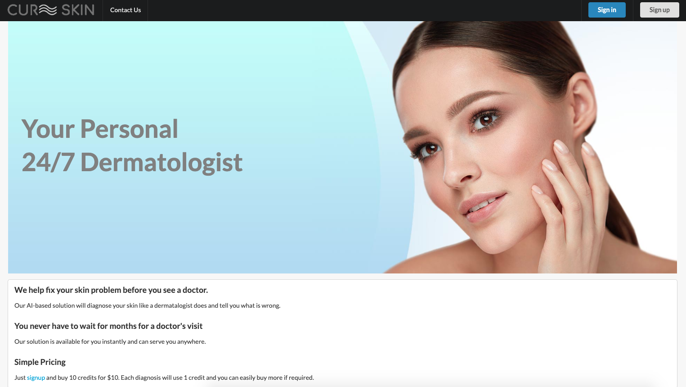
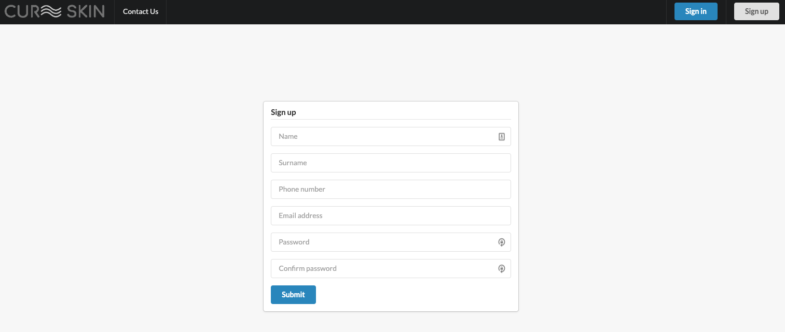
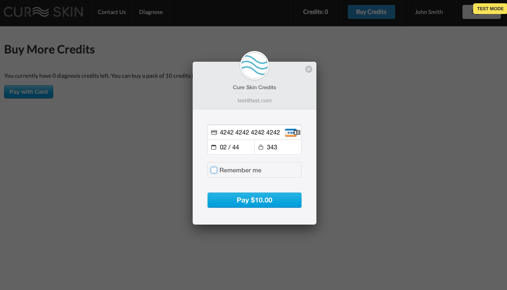
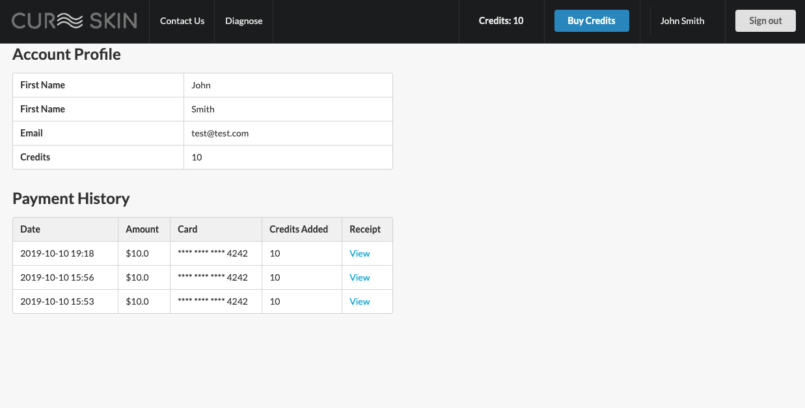
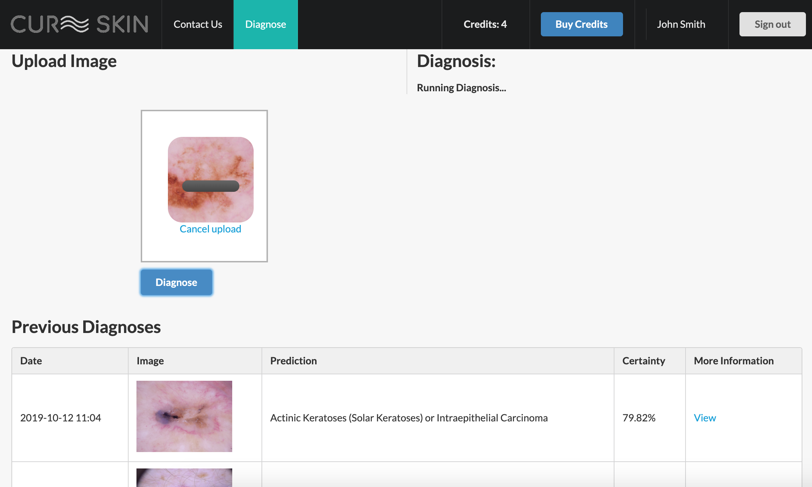
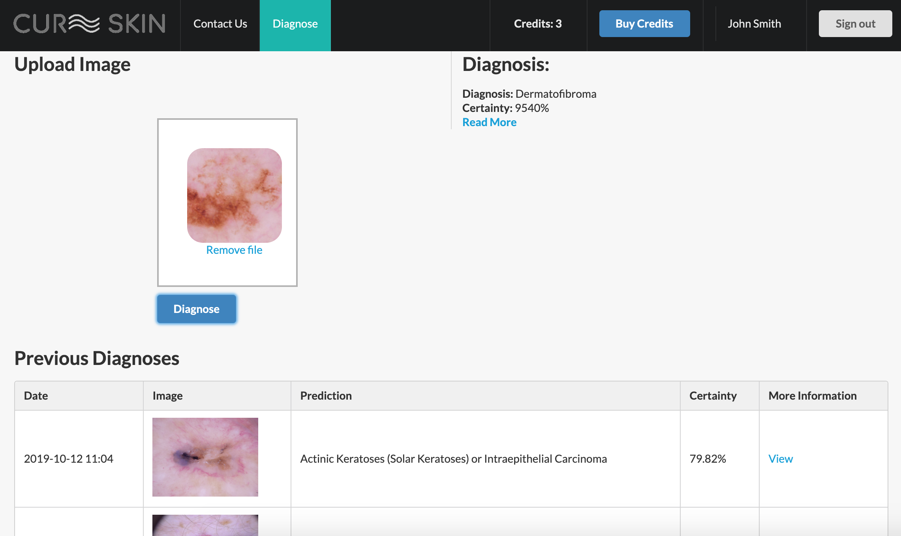

# Cure Skin

## Overview

Cure Skin is a Python Flask app using a Tensorflow DNN model trained to classify skin conditions from a picture and give
a diagnosis with suggested information the user can use to learn more.

## Model

The collab notebook used [Skin Cancer MNIST: HAM10000](https://www.kaggle.com/kmader/skin-cancer-mnist-ham10000) Kaggle dataset
for training and testing the model using Tensorflow. 

The model uses transfer learning with MobileNet model, to retrain the model to classify the following classes of skin conditions:

* Melanoma
* Melanocytic Nevi
* Actinic Keratoses (Solar Keratoses) or Intraepithelial Carcinoma
* Benign Keratosis
* Basal Cell Carcinoma
* Dermatofibroma
* Vascular Skin Lesion

The current model has a prediction accuracy of around 86%. While high, there is a class imbalance in the Kaggle dataset and the accuracy could 
be improved with more samples for the lesser weighted classes in our dataset.

The notebook and some sample test images can be found under the `/model` folder of this repository. The saved model is around 28MB and 
can be found at `/app/predict_api/model.h5` in this repository where its used for serving predictions to the user in the Flask app.

## Try Out Live Version

https://cureskin.onrender.com

The Stripe API is in test mode so you can use 4242 4242 4242 4242 for the card number to add credits to your
account.

## Walk Through

The user first lands on the home page and signs up for a new account, where they can buy credits to use for diagnosises of 
skin conditions:

 

A pack of 10 credits for $10 is purchased using Stripe, and 1 credit is deducted per diagnosis:

The user can view a list of their purchases on their user account page:

Once credits have been added to the account, the user can click on the 'Diagnosis' tab to
begin uploading images and receiving diagnosises from the AI model. They also have access to
a full history of all their previous diagnoses too:

## Setup

### Vanilla

- Install the requirements and setup the development environment.

	`make install && make dev`

- Create the database.

	`python manage.py initdb`

- Run the application.

	`python manage.py runserver`

- Navigate to `localhost:5000`.

## Configuration

The goal is to keep most of the application's configuration in a single file called `config.py`. I added a `config_dev.py` and a `config_prod.py` who inherit from `config_common.py`. The trick is to symlink either of these to `config.py`. This is done in by running `make dev` or `make prod`.

I have included a working Gmail account to confirm user email addresses and reset user passwords, although in production you should't include the file if you push to GitHub because people can see it. The same goes for API keys, you should keep them secret. You can read more about secret configuration files [here](https://exploreflask.com/configuration.html).

Read [this](http://flask.pocoo.org/docs/0.10/config/) for information on the possible configuration options.

## Contributors

This project was completed by:

* [David Gildeh](https://github.com/dgildeh)
* [Shamod Lacoul](https://github.com/shamod)
* [Craig Burnett](https://github.com/haggishm)

## Thanks

This Flask app is originally a fork of [Max Halford's](https://github.com/MaxHalford) 
[flask-boilerplate](https://github.com/MaxHalford/flask-boilerplate). 

## License

The MIT License (MIT). Please see the [license file](LICENSE) for more information.
